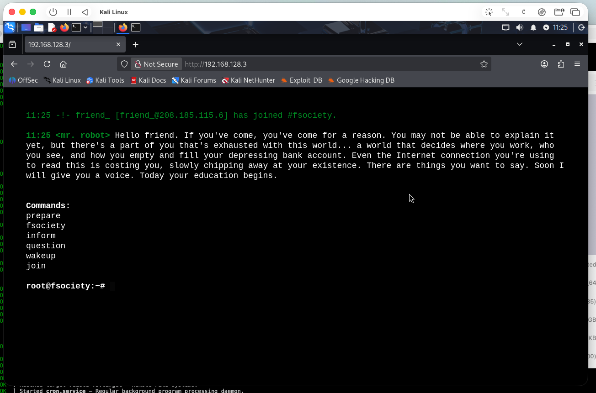
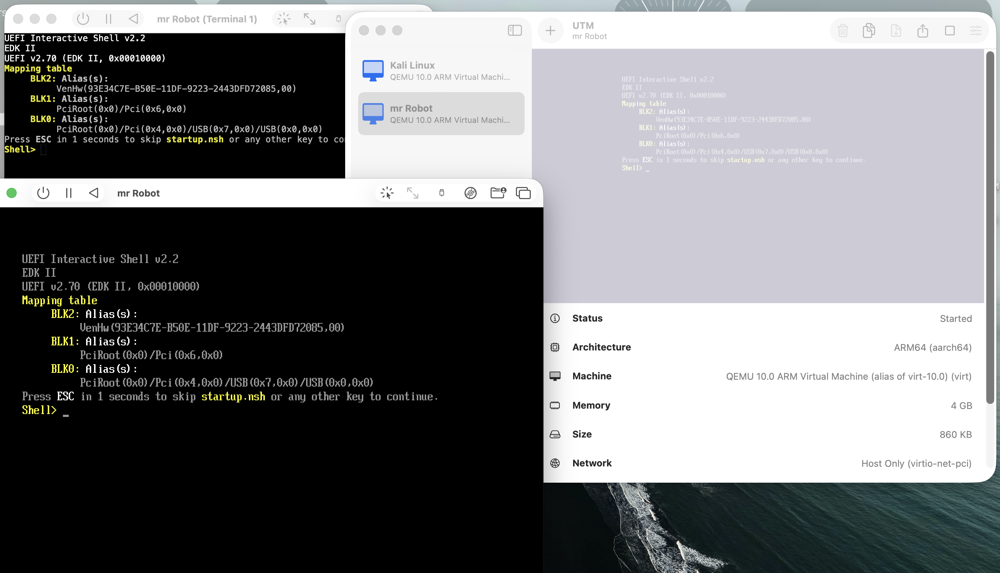
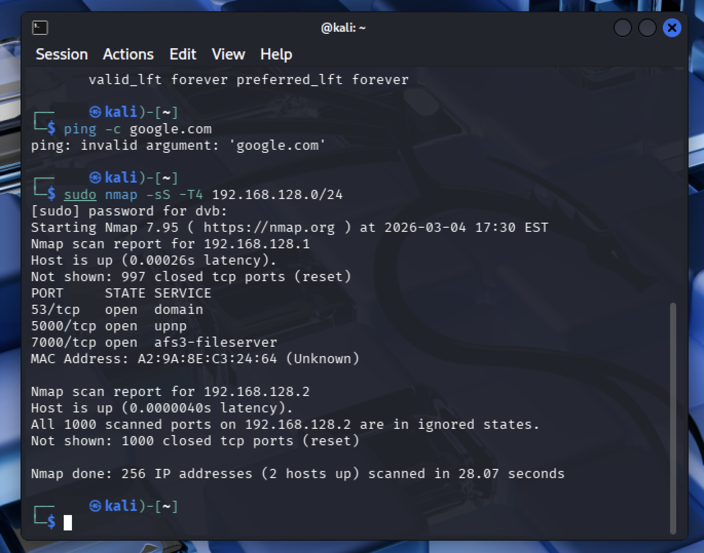

# 🔐 Hacking Lab on Apple Silicon Mac (M4)

A complete, isolated penetration testing lab running on a single Apple Silicon Mac — built with free, open-source tools.



## Overview

This project documents how I built a safe, secure hacking environment on an Apple M4 Mac using:

- **[UTM](https://mac.getutm.app)** — Free macOS virtualization (replaces VirtualBox for Apple Silicon)
- **[Kali Linux ARM64](https://www.kali.org/get-kali/)** — Industry-standard penetration testing OS
- **[Mr. Robot VM](https://www.vulnhub.com/)** — Deliberately vulnerable CTF target from VulnHub

The lab runs entirely on one machine with **Host Only networking**, meaning the vulnerable target is completely isolated from the internet and home network.

## Architecture

```
┌──────────────────────────────────────────────────────┐
│                  macOS Host (M4 Mac)                  │
│                                                       │
│   ┌──────────────────┐   ┌────────────────────────┐   │
│   │   Kali Linux     │   │    Mr. Robot VM        │   │
│   │   ARM64 native   │◄─►│    x86_64 emulated     │   │
│   │   192.168.128.2  │   │    192.168.128.3       │   │
│   │                  │   │    Ports: 80, 443      │   │
│   └──────────────────┘   └────────────────────────┘   │
│              │                       │                 │
│              └───────┬───────────────┘                 │
│                      │                                 │
│           Host Only Network (isolated)                 │
│           ✗ No internet    ✗ No home network           │
└──────────────────────────────────────────────────────┘
```

## Why UTM Instead of VirtualBox?

Most hacking lab tutorials use VirtualBox, which is designed for Intel x86 machines. Apple Silicon (M1–M4) uses ARM architecture, so the setup is different:

| | VirtualBox | UTM |
|---|---|---|
| **ARM support** | Limited (beta) | Excellent (native) |
| **x86 emulation** | Not on ARM Macs | Yes, via QEMU |
| **Cost** | Free | Free |
| **Best for** | Intel Macs | Apple Silicon Macs ✅ |

**Key concept:** Kali Linux runs in **Virtualize** mode (ARM64 native = fast), while VulnHub VMs run in **Emulate** mode (x86 via QEMU = slower but functional).

## Setup Steps

### 1. Install UTM
Download from [mac.getutm.app](https://mac.getutm.app) and drag to Applications.

### 2. Install Kali Linux ARM64
- Download the **Apple Silicon (ARM64)** installer ISO from [kali.org/get-kali](https://www.kali.org/get-kali/)
- In UTM: **Virtualize** → **Linux** → select the ISO
- 4 GB RAM, 4 CPU cores, 40 GB storage
- Install with XFCE desktop, credentials: `kali` / `kali`

### 3. Download and Convert the Mr. Robot VM
The `.ova` file from VulnHub needs to be converted for UTM:

```bash
# Extract the OVA (it's a tar archive)
cd ~/Downloads
tar xvf mrRobot.ova

# Install QEMU tools
brew install qemu

# Convert VMDK to QCOW2
qemu-img convert -O qcow2 mrRobot-disk1.vmdk mrrobot.qcow2

# Verify (should be ~2 GB)
ls -lh mrrobot.qcow2
```

### 4. Create the Mr. Robot VM in UTM
- **Emulate** (not Virtualize) → **Other**
- Machine: **Intel ICH9 based PC (x86_64)**
- Boot Device: **None**
- ⚠️ **Uncheck UEFI Boot** (Mr. Robot uses legacy BIOS)
- 1.5 GB RAM, 2 CPU cores
- Delete the default drive, then **Import** `mrrobot.qcow2` (IDE interface)

### 5. Configure Network Isolation
Set **both VMs** to **Host Only** networking in UTM settings. This ensures:
- ✅ VMs can communicate with each other
- ✗ VMs cannot reach the internet
- ✗ VMs cannot reach your home network
- ✗ External attackers cannot reach the vulnerable VM

### 6. Verify the Lab

```bash
# In Kali — check your IP
ip addr
# → 192.168.128.2

# Verify isolation (should fail)
ping -c 3 google.com
# → Network unreachable ✅

# Scan for the target
sudo nmap -sS -T4 192.168.128.0/24
# → Found 192.168.128.3 with ports 80 and 443 open ✅
```

Open Firefox in Kali → navigate to `http://192.168.128.3` → Mr. Robot landing page loads.

## Mistakes & Troubleshooting

### ❌ Created Mr. Robot VM as ARM64 instead of x86

**Problem:** VM dropped into UEFI Interactive Shell instead of booting.



**Root cause:** The Mr. Robot VM is built for Intel x86. Setting it up as ARM64 (Virtualize mode) meant UTM couldn't find a compatible bootloader on the disk.

**Fix:** Recreated the VM using **Emulate** mode with **x86_64** architecture and **UEFI Boot unchecked**.

---

### ❌ Nmap scan only found 2 hosts (target missing)

**Problem:** Scan showed the Mac gateway and Kali, but no Mr. Robot VM.



**Root cause:** The Mr. Robot VM was the broken ARM64 version stuck in the UEFI shell — it wasn't running an OS, so it had no network presence.

**Fix:** After recreating the VM correctly with x86 emulation, it booted into Linux, got an IP address, and appeared in the next Nmap scan.

---

### ❌ Bitdefender blocked disk conversion

**Problem:** `qemu-img convert` failed with `Operation not permitted`.


**Fix:** Clicked **Trust Application** in the Bitdefender popup, then re-ran the command successfully. Host antivirus software may need to whitelist security tools.

## Screenshots

| Screenshot | Description |
|---|---|
| `01-utm-installed.png` | UTM application with empty VM list |
| `02-kali-installer.png` | Kali Linux graphical installer in UTM |
| `03-kali-desktop.png` | Kali Linux desktop after login |
| `04-emulate-x86-setup.png` | UTM summary: x86_64 emulation config |
| `05-drive-imported.png` | UTM drives: mrrobot.qcow2 at 1.97 GB |
| `06-kali-ip-addr.png` | Kali terminal: IP address 192.168.128.2 |
| `07-mrrobot-landing-page.png` | Mr. Robot web page in Firefox |
| `08-uefi-shell-error.png` | UEFI shell (wrong VM config) |
| `09-nmap-only-2-hosts.png` | Nmap: only 2 hosts (before fix) |

## Key Takeaways

1. **Apple Silicon ≠ Intel.** Most hacking tutorials assume x86. On ARM Macs, use UTM with Emulate mode for x86 VMs.
2. **Virtualize vs. Emulate.** ARM64 images → Virtualize (fast). x86 images → Emulate (slower but works).
3. **UEFI vs. Legacy BIOS.** Older VMs use BIOS. Leaving UEFI enabled causes boot failures.
4. **OVA → QCOW2 conversion is required.** UTM doesn't import OVA/VMDK natively.
5. **Network isolation is non-negotiable.** Always use Host Only networking for vulnerable VMs.
6. **Troubleshooting is the real learning.** Every mistake taught something about VM architecture, boot processes, and networking.

## Resources

- [UTM — Virtual Machines for Mac](https://mac.getutm.app)
- [Kali Linux Downloads](https://www.kali.org/get-kali/)
- [VulnHub — Vulnerable VMs](https://www.vulnhub.com/)
- [NetworkChuck — Original Tutorial (YouTube)](https://www.youtube.com/networkchuck) (Thank you!)

---

*Built in March 2026 as part of my cybersecurity learning journey.*
